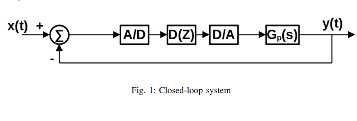
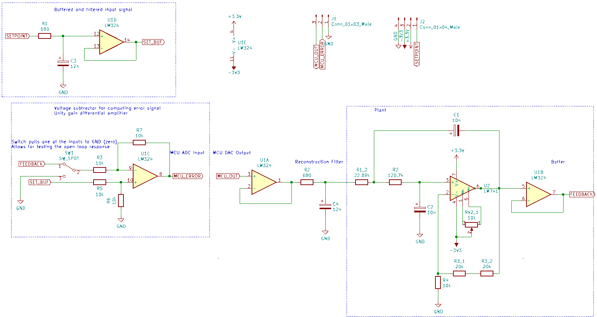
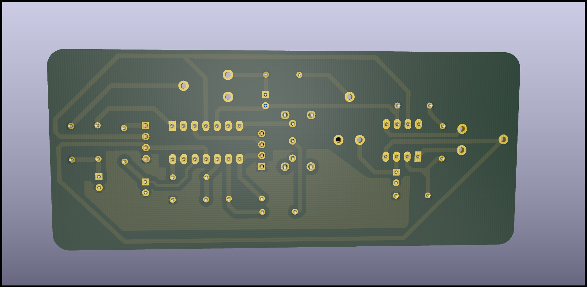
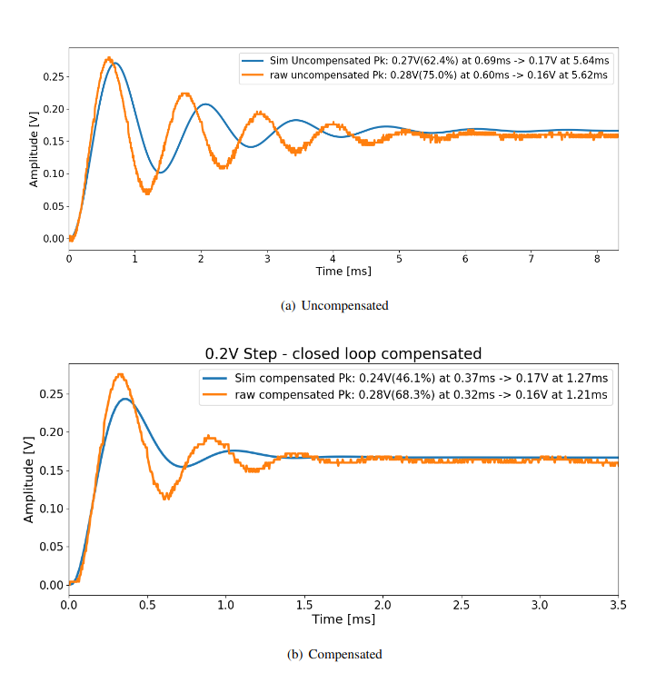

# digital-controller
digital control system implemented with stm32 mcu to correct the response of an analogue system.

the analogue system is realized with an opamp circuit.
a schematic and pcb was designed in kicad.

Finally, the step response of the system is analyzed.

